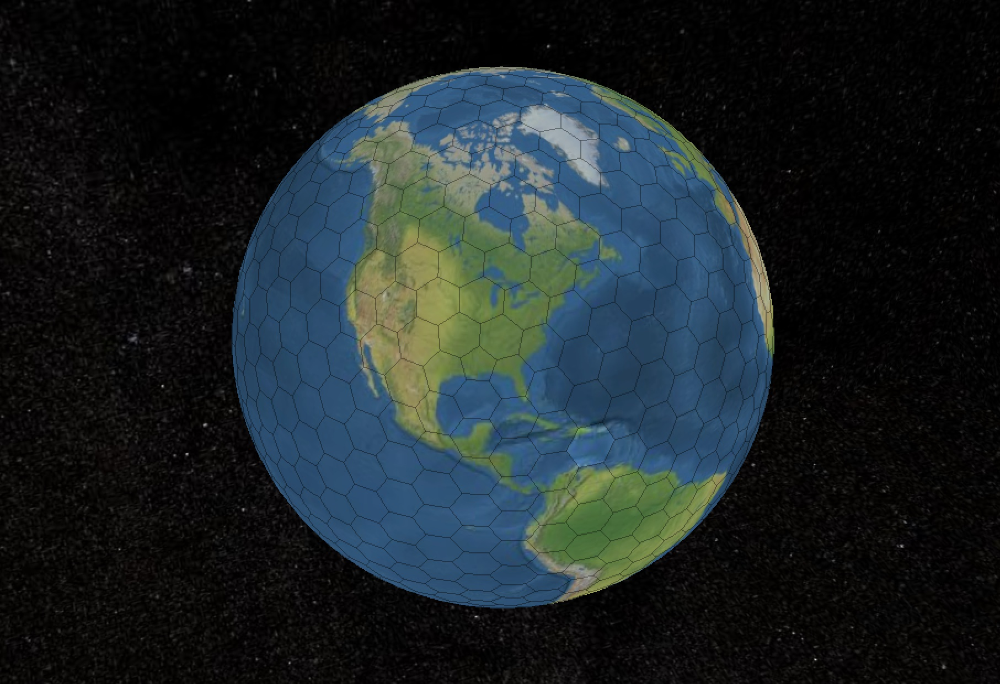

# 🌎 EARTH

EARTH is a [3D visualization](https://ownable.earth) of planet Earth that features 812 ownable Earth tiles. Each tile is represented by an [ERC-721 token](https://ethereum.org/en/developers/docs/standards/tokens/erc-721/) on Ethereum and can display a message chosen by its owner.

<!-- **Structure:**
The 812 tiles consist of 800 hexagons and 12 pentagons. They are organized in a [regular structure](https://levskaya.github.io/polyhedronisme/?recipe=tdtdtdtI). -->

## Development

For development, confer [BUILD.md](./BUILD.md).

## License

tbd
